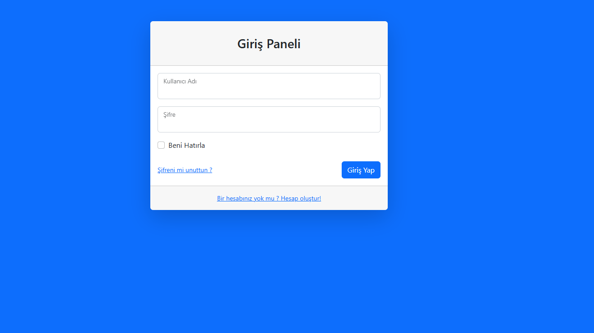
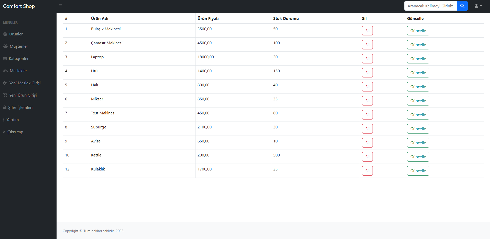
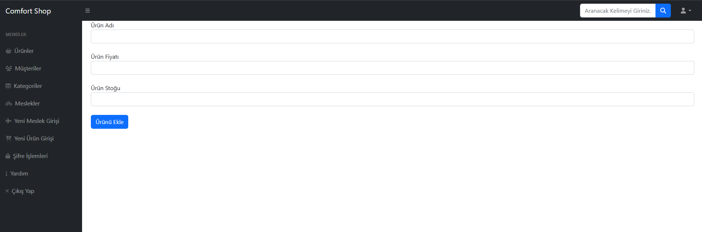
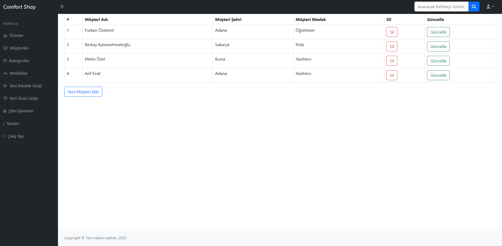
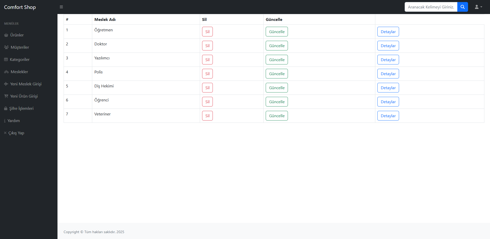
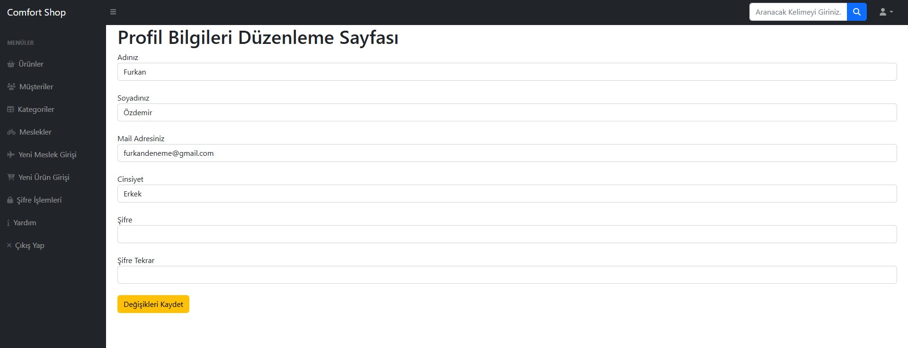

# C# ile N-Katmanlı Mimari Yönetim Paneli Projesi

Bu proje, Udemy'de yer alan **"C# ile Adım Adım Katmanlı Mimari"** kursu kapsamında geliştirilmiş bir e-ticaret yönetim paneli (admin panel) uygulamasıdır. Proje, modern yazılım geliştirme prensipleri ve mimari desenler kullanılarak oluşturulmuştur.

## 📜 Proje Hakkında

Uygulama, temel bir işletmenin Ürün, Müşteri, Kategori ve Meslek gibi varlıklarını yönetebileceği bir arayüz sunar. Projenin temel amacı, **N-Katmanlı Mimari (N-Tier Architecture)** yapısını ve **CRUD (Create, Read, Update, Delete)** işlemlerini C# ve .NET teknolojileriyle uygulamalı olarak göstermektir.

## ✨ Temel Özellikler

* **Güvenli Giriş:** Kullanıcı adı ve şifre ile sisteme giriş paneli.
* **Ürün Yönetimi:** Sisteme yeni ürün ekleme, mevcut ürünleri listeleme, güncelleme ve silme.
* **Müşteri Yönetimi:** Müşteri bilgilerini (Ad, Şehir, Meslek) yönetme.
* **Kategori ve Meslek Yönetimi:** Dinamik olarak yeni meslek ve kategori tanımlama.
* **Kullanıcı Profili:** Kullanıcıların kendi profil bilgilerini ve şifrelerini güncelleyebilmesi.

## 🏗️ Teknik Yapı ve Mimari

Proje, sorumlulukların ayrılması (Separation of Concerns) ilkesine sadık kalarak **N-Katmanlı Mimari** ile tasarlanmıştır.

* **`EntityLayer`:** Veritabanı tablolarına karşılık gelen varlık (POCO) sınıflarını içerir.
* **`DataAccessLayer`:** Veritabanı işlemlerinden sorumludur. **Entity Framework** ve **Generic Repository Pattern** kullanılarak verimli ve tekrar kullanılabilir bir veri erişim katmanı oluşturulmuştur.
* **`BusinessLayer`:** İş kurallarının ve mantığının bulunduğu katmandır. Girdi doğrulamaları için **FluentValidation** kütüphanesi entegre edilmiştir.
* **`PresentationLayer (UI)`:** Son kullanıcıya sunulan arayüzdür. **ASP.NET Core MVC** ile geliştirilmiştir ve Business katmanı ile haberleşir.

### 🚀 Kullanılan Teknolojiler

* **Backend:** C#, .NET
* **ORM:** Entity Framework
* **Mimari:** N-Tier Architecture, Generic Repository Pattern
* **Doğrulama (Validation):** FluentValidation
* **Frontend:** HTML, CSS, Bootstrap
* **Veritabanı:** Microsoft SQL Server

## 📸 Ekran Görüntüleri

#### **Giriş Paneli**

---

#### **Ürün Listesi ve Yönetimi**

---

#### **Yeni Ürün Ekleme**

---

#### **Müşteri Listesi**

---

#### **Meslek Yönetimi**

---

#### **Profil Düzenleme**

